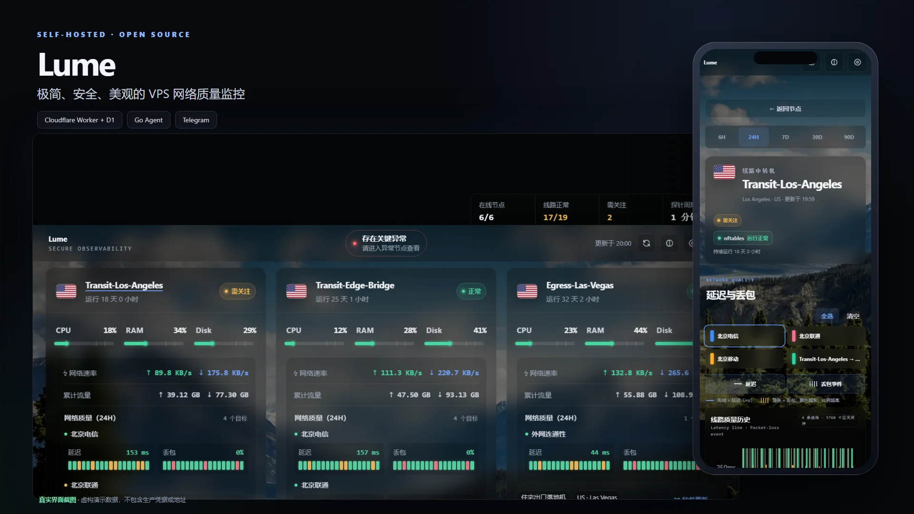

# Lume

一个可自托管、面向任意数量 Linux VPS 的轻量监控系统。它由只出站的 Go Agent、Cloudflare Worker、D1、Telegram Bot 和响应式网页面板组成。

**Lume** 取“光与清晰可见”之意：用尽量小的暴露面，把关键状态照亮。

> This repository is a sanitized, self-hostable edition. It contains no production credentials, host addresses, account identifiers, or private deployment data.



> PC 与移动端均为项目真实渲染截图；画面使用内置虚构演示数据，不包含生产凭据、主机地址或账号信息。

## 10–15 分钟快速上线

准备一个 Cloudflare 账号、一个 Telegram Bot 和一台可用 SSH + sudo 登录的 systemd Linux VPS。VPS 无需安装 Node.js、Go、Docker 或数据库。

```bash
git clone https://github.com/MostlyCodex/lume-monitor.git
cd lume-monitor/worker
npm ci
npm run doctor
npm run setup
```

`setup` 会按顺序完成 D1、migrations、Worker、Secrets、Telegram Webhook 和健康检查，并可继续安装首台 Agent。它会自动生成每个节点的独立密钥，始终向 Cloudflare 提交完整 `NODE_KEYS`，避免新增节点时误覆盖旧密钥。一般只需准备：

- Cloudflare 登录授权；
- Telegram Bot 用户名和 BotFather 给出的 Token；
- 首台节点的名称、用途、地区及 SSH 别名。

完成后私聊 Bot 执行工具给出的 `/bind ...`，再发送 `/panel` 即可进入面板。图文式流程、每一步会改什么和故障恢复方法见[快速部署指南](docs/quickstart.md)；需要完全手工控制时使用[从零搭建教程](docs/getting-started.md)。

## 通用模型

每台 VPS 使用**同一个 Agent、同一个配置结构和同一套安装脚本**。节点名、用途和数量都不写死在代码或数据库迁移中。

| 层次 | 是否必需 | 作用 |
| --- | --- | --- |
| 基础主机监控 | 是 | CPU、负载、内存、Swap、磁盘、inode、流量、错误、启动与 Agent 状态 |
| systemd 服务监测 | 否 | 监测零个到多个本机服务，只读状态，不重启、不修改 |
| ICMP 通信探针 | 否 | 监测节点到节点或外部参考目标的 RTT 与 Echo 丢包率 |
| TCP 建连探针 | 否 | 监测指定主机与端口的建连耗时和失败率，不发送应用数据 |
| nftables 转发计数 | 否 | 读取明确选择的规则累计命中数，展示增量和每分钟速率 |

新增 VPS 时只需：

1. 在 Worker 的 `NODE_KEYS` 中加入一个任意安全节点 ID 和独立密钥；
2. 复制 `deploy/config.example.json`，填写节点信息和同一密钥；
3. 安装 Agent。

无需修改 Agent/Worker 源码、D1 schema 或面板。已认证的首份报告会自动注册节点及其可选监测项。

## 功能

- 任意数量和任意角色的 VPS 动态注册与展示。
- ICMP 多样本探测，记录 p50/p95、RTT 标准差、丢包率和采样覆盖率。
- 可选 TCP Connect 多样本探测，记录建连延迟与建连失败率；不执行 TLS、HTTP、登录或任意命令。
- 可选 nftables 规则计数观测，只上传名称、命中增量、时间间隔与速率，不上传规则、地址、域名或载荷。
- 首页保持 ICMP 线路质量视图；TCP 与转发活动仅在已配置节点的详情中出现。
- 节点间 `node-link` 探针自动生成通信关系和链路分析。
- Agent 使用 HMAC-SHA256 签名上报，带时间窗、nonce 和重放保护。
- D1 保存最新状态、原始样本、长期聚合、运行事件和 IP 历史。
- Telegram Webhook 仅向已绑定账号提供按需的 `/status`（查看实时状态）、`/panel`（打开监控面板）和 `/help`（查看命令说明）；状态按节点分组展示，不主动推送告警或日报。
- 一次性链接登录的自适应毛玻璃面板：首页以动态节点卡片展示 24 小时线路状态格和资源刻度，历史图表进入独立节点详情查看。
- 顶部设置入口可在当前浏览器自定义面板名称、首页文案、节点卡片顺序、显示名、角色、国家和城市；设置不新增网络请求，也不修改监测数据。

## 与主流探针对比

Lume 不是哪吒或 Komari 的全功能替代品，而是更聚焦线路质量与最小权限的精简方案。

| 维度 | Lume | 哪吒 | Komari |
| --- | --- | --- | --- |
| 核心定位 | 主机状态与少量显式网络/转发观测 | 服务器、网站监控与综合运维 | 实时主机监控与可扩展面板 |
| 后端 | Cloudflare Worker + D1，无需独立面板服务器 | 自托管 Dashboard | 自托管服务端 |
| Agent 通信 | 定时 HMAC/HTTPS 单向上报 | 出站 gRPC 长连接 | WebSocket，支持 POST 回退 |
| 被监测端口 | 不新增入站端口 | 通常不新增入站端口 | 通常不新增入站端口 |
| 远程能力 | 无远程命令、终端、文件管理或自动更新 | 可配置命令、终端、文件及 NAT 等任务 | 可配置远程命令与 Web SSH |
| 网络监测 | 配置驱动的 ICMP RTT/丢包、TCP 建连及 nftables 规则计数 | ICMP、TCP、HTTP 等服务监测 | Ping、任务与通用状态监测 |
| 告警方式 | Telegram 按需查询，不主动告警 | 完整通知与告警体系 | 通知、任务及管理功能 |
| 生态与平台 | Linux/systemd 优先，代码与依赖较少 | 平台覆盖和运维功能更丰富 | 多平台、主题与插件生态更丰富 |

选择 Lume，适合重视**线路延迟与丢包、无远程控制、低暴露面**的场景；需要秒级刷新、跨平台、复杂告警或远程运维时，哪吒和 Komari 更合适。参见[哪吒官方文档](https://nezha.wiki/)、[Komari 官方文档](https://komari-document.pages.dev/)。

## 安全边界

- Agent 不监听端口，只发起配置中明确声明的出站连接。
- `/etc/vpsmon/config.json` 是唯一执行清单：Agent 不生成隐藏探针，也不会探测未写入 `probes` 的目标；通信探针必须明确写为 `kind: "icmp"` 或 `kind: "tcp"`。
- Agent 以无特权用户运行；systemd 服务状态检查是只读的。
- TCP 使用普通出站 socket，无额外权限；仅在配置 nftables 计数时启用短时 oneshot，它只持有 `CAP_NET_ADMIN`，常驻 Agent 仍无 capability。
- 安装脚本只管理 `/opt/vpsmon`、`/etc/vpsmon`、`/var/lib/vpsmon` 及项目自己的 systemd units。
- Agent 成功升级后只保留最新 3 份校验过的回滚备份；清理器只匹配严格时间戳目录，不触碰其他状态文件。
- 系统不会自动切换线路，也不会修改 nftables、Xray 或其他业务配置。
- 密钥通过 Cloudflare Worker Secrets 和权限为 `0640` 或更严格的 VPS 配置文件保存。

完整说明见 [SECURITY.md](SECURITY.md)。

## 架构

```text
任意 VPS Agent ── HMAC/HTTPS ──> Cloudflare Worker ──> D1
      │                                  │               │
      ├── 基础主机指标                   ├── Telegram    ├── latest/history
      ├── 可选 systemd 服务              └── Dashboard   └── rollups/events
      ├── 可选 ICMP/TCP 通信探针
      └── 可选 nftables 数字计数快照
```

设计说明见 [docs/architecture.md](docs/architecture.md)，测量口径见 [docs/monitoring-methodology.md](docs/monitoring-methodology.md)，可选能力的配置与清理见[功能手册](docs/probes.md)，测试与可信发布流程见 [docs/testing-and-releases.md](docs/testing-and-releases.md)。

## 开始使用

首次部署优先使用上面的 `npm run setup`。管理工具保存可恢复的部署进度，并把私密状态放在被 Git 忽略的 `.lume/`；它不把 Bot Token 保存到本机，也不会在终端打印节点密钥。完整命令见[快速部署指南](docs/quickstart.md)。下面保留手工部署流程，供已有部署或需要逐步审计的人使用。

### 手工部署：从零到面板

1. 准备 Git、Node.js 22+、Go 1.26+、Cloudflare 账号、Telegram Bot 和至少一台 systemd Linux VPS。
2. 创建后端：

   ```bash
   git clone https://github.com/MostlyCodex/lume-monitor.git
   cd lume-monitor/worker
   npm ci
   npx wrangler login
   npx wrangler d1 create lume
   ```

3. 将 `worker/wrangler.example.jsonc` 复制为被 Git 忽略的 `worker/wrangler.jsonc`，填写 Worker 名称、D1 `database_id`、最终 Worker URL 和 Bot 用户名，然后执行：

   ```bash
   npx wrangler d1 migrations apply lume --remote
   npm run check
   npm run deploy
   ```

4. 为每台 VPS 生成独立随机密钥，以**完整 JSON 映射**写入 `NODE_KEYS`，再设置管理令牌：

   ```json
   {"my-vps-01":"<NODE_SECRET_1>"}
   ```

   ```bash
   npx wrangler secret put NODE_KEYS
   npx wrangler secret put ADMIN_TOKEN
   ```

5. 按[完整教程第 3 节](docs/getting-started.md#3-配置-telegram-和面板登录)设置 Telegram 的 Bot Token、Webhook Secret 和一次性绑定码哈希，然后在 Bot 私聊中发送 `/bind <code>`。内置网页面板使用 `/panel` 生成登录链接，不需要 Telegram 群组。
6. 编译一次通用 Linux Agent：

   ```bash
   cd ../agent
   mkdir -p bin
   go test ./...
   CGO_ENABLED=0 GOOS=linux GOARCH=amd64 go build -trimpath \
     -ldflags="-s -w -X main.version=1.2.0" \
     -o bin/vpsmon-agent-linux-amd64 ./cmd/vpsmon-agent
   cd ..
   ```

   ARM VPS 将 `GOARCH` 改为 `arm64`。Windows PowerShell 的对应命令见[完整教程第 4 节](docs/getting-started.md#4-编译通用-agent)。

7. 把 `deploy/config.example.json` 复制到仓库外的私密目录，至少修改 `node.id`、展示信息、Worker `endpoint` 和匹配的节点 `secret`。不需要附加监测时保持：

   ```json
   "services": [],
   "probes": [],
   "nftables_counters": []
   ```

   三项可选模块可在添加节点时配置，也可稍后运行 `npm run node:configure -- NODE_ID` 调整。字段、语义和干净下线方法见[功能手册](docs/probes.md)。

8. 按[完整教程第 6 节](docs/getting-started.md#6-安装首台-agent)将二进制、私密配置、systemd unit 和安装脚本放入 VPS 的 `/tmp/vpsmon-stage.<random>`，生成校验和并运行安装器。首份认证报告会自动创建面板目录，最后用 `/status`、`/panel` 验收。

### 以后增加一台 VPS

不需要改 Agent/Worker 源码，也不需要写 D1 migration：

```bash
cd worker
npm run node:add
```

管理工具会维护并同步完整 `NODE_KEYS`、生成私密节点配置，并可通过 SSH 安装已校验的 GitHub Release。手工流程如下：

1. 选一个新的唯一节点 ID；
2. 生成新的独立密钥；
3. 在安全保存的完整 `NODE_KEYS` JSON 中追加它；
4. 重新执行 `npx wrangler secret put NODE_KEYS` 并粘贴**包含所有旧节点和新节点**的完整映射；
5. 再复制一份 `deploy/config.example.json`，填写新节点信息和新密钥；
6. CPU 架构相同就复用已有 Agent 二进制；
7. 用同一安装脚本部署；
8. 等待首份上报，节点会自动出现在 `/status` 和面板。

只提交新节点的局部 `NODE_KEYS` 会让所有旧节点失去认证能力。完整示例见[新增 VPS 指南](docs/getting-started.md#7-以后增加一台-vps)。

### 默认频率

- CPU、RAM、磁盘、流量和服务状态：每 60 秒采集并上报；
- 已配置的 ICMP/TCP 主动探测：模板默认每 60 秒执行；
- 已配置的 nftables 计数快照：每 60 秒读取一次；空配置时对应 timer 不启用；
- Worker 将每轮资源样本和整组探针结果分别压缩成单行时间序列，并继续兼容读取旧历史。当前约 5 台节点、十余个探针可按 60 秒运行在 D1 免费日额度内；扩容前仍应按节点数核算并观察 D1 Analytics，长期 30 秒不推荐。

采集频率与页面显示分辨率相互独立：

| 视图 | 时间范围 | Worker 返回时间桶 |
| --- | ---: | ---: |
| 首页全节点网络质量 | 最近 24 小时 | 5 分钟 |
| 单节点详情 | 6 小时、24 小时 | 1 分钟 |
| 单节点详情 | 7 天、30 天 | 1 小时 |
| 单节点详情 | 90 天 | 1 天 |

首页用 5 分钟数据桶控制多节点载荷，再将其合并成 18 个可见色块；进入节点详情后，6/24 小时曲线会保留每次 60 秒上报的分辨率。这里的显示聚合不会减少 Agent 探测次数，也不会改变 D1 原始数据保留期。

频率约束、流量公式和容量建议见[完整教程第 8 节](docs/getting-started.md#8-采集与探测频率)。

### 可选观测的执行清单与清理

- ICMP 显示在首页、详情和 Telegram `/status`；TCP 使用“建连失败率”且只在详情和按需状态中显示；
- nftables 计数只在配置它的节点详情中显示“转发活动”，空配置不会读取规则或产生后台任务；
- Agent 会按 `probe_interval_seconds` 执行配置中的**每一项**。如果某项已经没有使用场景，必须从节点配置删除，而不是只在前端隐藏。

仓库提供 `deploy/prune-probes.py` 生成不含指定探针的全新配置；它不覆盖源文件，可先校验再替换：

```bash
python3 prune-probes.py \
  --input /etc/vpsmon/config.json \
  --output /tmp/config.next.json \
  --remove OLD_PROBE_NAME

sudo /opt/vpsmon/vpsmon-agent --config /tmp/config.next.json --dry-run
```

可重复 `--remove` 一次删除多项。完成备份并安装新配置、仅重启 `vpsmon-agent` 后，下一份认证报告会自动把缺失探针和对应链路标为禁用。nftables 计数应从 `nftables_counters` 删除并通过升级器部署；数组变空时升级器会停用 timer 并删除数字快照。已有历史样本会按保留策略自然过期，不会继续发包或触发额外采集。完整步骤见[功能手册的干净停用章节](docs/probes.md#干净停用)。

## 手动下线节点

下线顺序很重要：**先停止 Agent，再停用目录**。正常报告会同步节点元数据并将目录项重新启用，如果先改数据库而 Agent 仍在运行，节点会在下一次上报时重新出现。

### 1. 停止上报

在待下线 VPS 上执行：

```bash
sudo systemctl disable --now vpsmon-agent.service vpsmon-nftables-snapshot.timer
systemctl is-active vpsmon-agent.service
```

第二条命令应返回 `inactive`。这一步只停止监控，不影响 nftables、Xray、SSH 或其他业务服务。

### 2. 撤销节点密钥

从生产 `NODE_KEYS` JSON 的**完整映射**中删除该节点 ID，然后重新写入 Worker Secret：

```bash
cd worker
npx wrangler secret put NODE_KEYS
```

Cloudflare Secret 不能读取明文；部署者必须在安全位置维护完整映射。不要只提交一个节点的局部 JSON，否则其他 Agent 会同时失去上报权限。密钥不得写入 Git、README、Issue 或构建日志。

如果完整 `NODE_KEYS` 已经遗失、暂时无法安全重写，可把节点 ID 加入独立撤销列表，立即阻止旧密钥再次认证或重新创建目录：

```bash
cd worker
npx wrangler secret put REVOKED_NODE_IDS
```

输入严格 JSON 数组，例如 `["retired-vps"]`。撤销列表在查找节点 HMAC 密钥前生效；恢复节点时必须先从该数组移除节点 ID。它是无法重写完整 `NODE_KEYS` 时的安全兜底，能够使旧密钥失效，但仍建议在取得其余活动节点密钥后重写 `NODE_KEYS`，物理移除旧映射。

### 3. 从活动目录移除

将以下 `NODE_ID` 和数据库名替换为实际值：

```bash
npx wrangler d1 execute YOUR_DATABASE --remote --command "UPDATE node_catalog SET enabled=0, updated_at=unixepoch() WHERE node_id='NODE_ID'; UPDATE service_catalog SET enabled=0, updated_at=unixepoch() WHERE node_id='NODE_ID'; UPDATE probe_catalog SET enabled=0, updated_at=unixepoch() WHERE node_id='NODE_ID' OR target_node_id='NODE_ID'; UPDATE counter_catalog SET enabled=0, updated_at=unixepoch() WHERE node_id='NODE_ID'; UPDATE business_routes SET enabled=0, updated_at=unixepoch() WHERE source_node_id='NODE_ID' OR target_node_id='NODE_ID';"
```

确认节点已停用：

```bash
npx wrangler d1 execute YOUR_DATABASE --remote --command "SELECT node_id, display_name, enabled FROM node_catalog WHERE node_id='NODE_ID';"
```

目录停用会让节点从网页面板和 Telegram `/status` 中消失，但保留 D1 历史样本、聚合和事件，以便审计或恢复。

### 4. 可选：卸载 Agent

确认不再恢复该节点后，将 `deploy/uninstall-agent.sh` 放到 VPS 上执行：

```bash
sudo sh uninstall-agent.sh --confirm
```

卸载脚本删除 Agent、配置、项目 systemd units 和 nftables 数字快照；保留 `vpsmon` 服务账号与报告 spool，避免不可逆地清除恢复资料。它不会修改 nftables 规则、Xray、SSH 或其他业务配置。

## 面板显示自定义

登录面板后点击顶部齿轮，可以修改面板名称、首页标题和副标题，也可以调整节点卡片顺序以及每个节点的显示名、角色标题、两位国家代码和城市/区域。保存后即时应用到首页、搜索和节点详情。

这些设置只写入当前浏览器的 `localStorage`：

- 不写入 D1，不改变 Agent 上报元数据；
- 不增加 API 请求或页面网络延迟；
- 不同浏览器和设备互不自动同步；
- 点击“恢复默认”即可重新使用服务端目录信息。

## 面板设计

首页采用状态头部、CPU/RAM/Disk 横向资源刻度、网络速率/累计流量以及逐目标的 24 小时延迟与丢包能量格。一个节点可以同时展示多条运营商探测和节点间链路，不会被压缩成单一平均值。资源刻度以连续长度表示当前占用，并在 70%/85% 标示关注与异常阈值；CPU/RAM/Disk 仅在首页展示，不在详情重复出现。详情页提供时间范围切换、可点选的目标图例以及延迟、失败事件和网络速率历史，其中 6/24 小时曲线按 1 分钟显示，7/30 天按小时显示，90 天按天显示。配置 TCP 时沿用相同图表但明确标为建连失败；配置 nftables 计数时才出现“转发活动”卡片和速率曲线。进入 6/24 小时详情时先用首页已加载的数据即时绘制，精细历史在后台替换并在当前会话缓存；系统不会预取所有节点。网络速率由相邻两次 Agent 上报的网卡累计字节差除以上报时间差计算，代表最近一个上报区间的平均速率，不是实时流式测速。

卡片指标右侧的数字表示最新一轮探测；下方 18 个能量棒色块表示最近 24 小时，每个色块约覆盖 80 分钟。历史丢包率按色块内实际 ICMP 尝试数和成功数加权，而不是直接平均百分比：不超过 2% 为绿色，超过 2% 至 10% 为黄色，超过 10% 为红色；若任一五分钟桶达到 60%，所在色块直接标红。最新一轮仍采用探针自身配置的失败率阈值，因此能及时显示刚发生但尚未显著影响长窗口平均值的异常。完整公式与设计依据见 [监测方法与技术实现](docs/monitoring-methodology.md#首页当前值与-24-小时能量棒)。

视觉层级参考了 [Komari Next](https://github.com/tonyliuzj/komari-next) 的节点卡片和 [Komari Theme Emerald](https://github.com/Tokinx/komari-theme-emerald) 的详情页组织方式；实现仍是项目自己的原生 HTML/CSS/JavaScript，并继续使用本地固定版本的 uPlot，不引入 React、Vue 或 ECharts 运行时。参考项目的许可信息见 [THIRD_PARTY_NOTICES.md](THIRD_PARTY_NOTICES.md)。

## 目录

| 路径 | 作用 |
| --- | --- |
| `agent/` | 通用 Linux Go Agent 与测试 |
| `worker/` | Cloudflare Worker、通用 D1 schema、动态面板和测试 |
| `deploy/` | 单一配置模板、安装/卸载脚本和 systemd unit |
| `tools/` | `lumectl` 首次部署、节点密钥与 Agent 安装管理 |
| `docs/` | 架构、探针和部署文档 |
| `scripts/` | 可重复的开发与性能验证脚本 |

## 开发

```bash
cd agent
go test ./...

cd ../worker
npm ci
npm run test:ci

# 使用完全虚构的数据预览面板，不需要 D1 或生产密钥
npm run preview:dashboard
```

`npm run test:ci` 会在临时目录中验证全新 D1、历史结构升级、真实本地 Worker HTTP 合约，并用 Playwright/Chromium 在 1440、1024、768 和 390 四种视口检查实际面板。全部使用虚构数据，不连接线上 Worker 或 D1。Linux Agent 性能基准及 GitHub Release 规则见[测试与发布文档](docs/testing-and-releases.md)。

## 发布策略

Git 提交和版本标签是唯一历史记录。构建缓存、ZIP 和本机交付副本不进入仓库；二进制发行物应附加到 GitHub Release。

## License

[MIT](LICENSE). Agent binary releases must also include [THIRD_PARTY_NOTICES.md](THIRD_PARTY_NOTICES.md).
